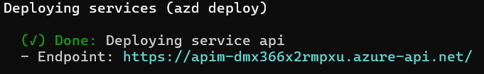

This is only provided for people who cannot do admin consent. And brings additional manual steps as work around to consent permissions required by MCP server individually. This branch does not do admin consent for Microsoft Graph User.Read permission to avoid permission issues. Please follow step 2 in Quick Start section to consent the User.Read permission manually.

> This is for TEST PURPOSE only! Do not leverage this method to consent in production environment.


# MCP Servers authorization with Protected Resource Metadata (PRM) sample 

A complete sample implementation of a Model Context Protocol (MCP) server that demonstrates secure authorization using Protected Resource Metadata (PRM) and Microsoft Graph API integration.

## Overview

This sample implements the latest draft version of [MCP Authorization specification](https://modelcontextprotocol.io/specification/draft/basic/authorization) with Protected Resource Metadata (PRM), which simplifies the authorization implementation a lot. The server is built with ASP.NET Core and deployed to Azure with full infrastructure automation.

## Key Features

- **🔐 Latest MCP Authorization**: Implements MCP Authorization with Protected Resource Metadata (PRM)
- **🚀 Zero-Config Deployment**: Complete infrastructure setup with a single command
- **🔑 Secure by Design**: Uses Managed Identity as Federated Identity Credential (no client secrets)
- **📊 Microsoft Graph Access**: Demonstrates accessing protected resources with user-delegated permissions

## Prerequisites

- [Azure Developer CLI (azd)](https://aka.ms/azd)
- Azure subscription
- VS Code Insiders (for testing)

## Quick Start

### 1. Deploy to Azure

Deploy the complete solution to Azure with a single command:

```shell
azd up
```

This will provision:
- Azure API Management service
- App Service with the MCP server
- Microsoft Entra App
- Managed Identity as federated credential
- Application Insights for monitoring
- All necessary configuration

### 2. Manually consent required permission
Replace tenant id and client id in below url and use the url to manually login and consent User.Read permission for your MCP server. Everyone who try this MCP server needs to take this step individually.
You can find the value of client id in APIM's `McpClientId` Named Value.

Continue the next step after Entra ID redirected you to localhost. It's expected that the redirected localhost page cannot be accessed. As long as you finished the consent step from Entra ID side, you're good to go to the next step.
```
https://login.microsoftonline.com/{tenant}/oauth2/v2.0/authorize?client_id={client-id-created-by-azd-up}&response_type=code&redirect_uri=http%3A%2F%2Flocalhost%3A3000&response_mode=query&scope=User.Read&state=12345&code_challenge=FKb6UkkRio0kIiAfYzJoVa4GGmZ6v6QVgQ5PjTA2iMk&code_challenge_method=S256
```
> This is for TEST PURPOSE only! Do not leverage this method to consent in production environment.

### 3. Test with VS Code

1. **Install latest VS Code Insiders**
2. **Add MCP Server**:
   - Open Command Palette (`Ctrl+Shift+P`)
   - Run `MCP: Add Server`
   - Select `HTTP` as the server type
   - Enter the endpoint URL from the `azd up` output:
   
   

3. **Authorize and Test**:
   - After a while, VS Code will prompt you to sign in to Microsoft
   - After authentication, open GitHub Copilot
   - Ask: "Who am I?" - Copilot will use the MCP server to retrieve your profile


### MCP Tools

The sample includes one MCP tool:

- **`ShowUserProfile`**: Retrieves the current user's profile information from Microsoft Graph, including display name, email, job title, and department.
